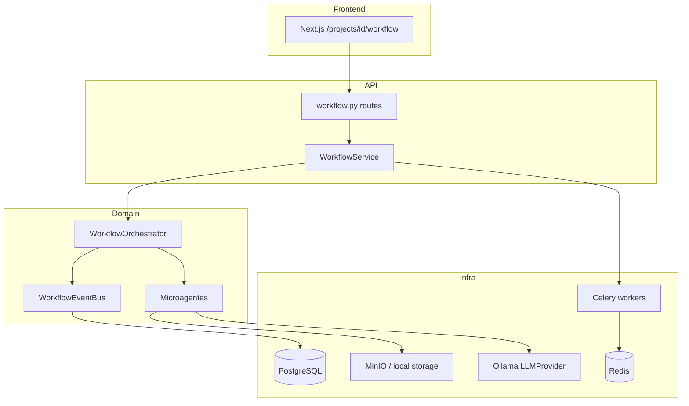
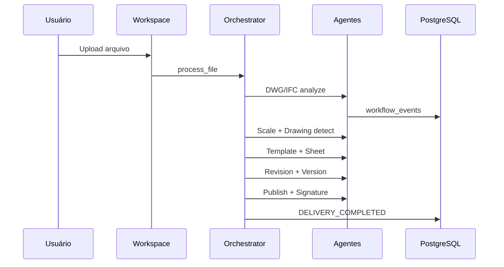

# Workflow Projetos — Arquitetura Técnica

> Módulo de engenharia documental: projetos, pranchas, revisões, publicação e entrega.  
> **Fase atual:** 3 (Wizard de Entrega GRD + nomenclatura + templates A0–A4)

## Visão geral

O Workflow Projetos transforma arquivos técnicos (DWG, DXF, IFC, PDF…) em documentação estruturada com pranchas, revisões, versionamento e pacotes de entrega. A arquitetura segue **Clean Architecture + DDD + EDA**, preparada para evolução multi-tenant SaaS.



## Camadas

| Camada | Local | Responsabilidade |
|--------|-------|------------------|
| Apresentação | `frontend/app/projects/[id]/workflow` | Dashboard workflow por projeto |
| API | `backend/app/routes/workflow.py` | REST `/workflow/*`, `/projects/{id}/workflow/*` |
| Aplicação | `backend/app/services/workflow_service.py` | Casos de uso, serialização |
| Domínio | `backend/core/workflow/` | Orquestrador, agentes, event bus, template engine |
| Infra | `backend/core/database/workflow_models.py` | Persistência PostgreSQL |

## Event Driven Architecture

Eventos persistidos em `workflow_events`:

| Evento | Disparo |
|--------|---------|
| `PROJECT_CREATED` | Inicialização de pastas |
| `FILE_UPLOADED` | Upload no workspace |
| `DWG_ANALYZED` / `DXF_ANALYZED` / `IFC_ANALYZED` | Análise CAD/BIM |
| `DRAWING_DETECTED` | Classificação automática |
| `SHEET_GENERATED` | Composição de prancha |
| `REVISION_CREATED` | Controle REV00… |
| `PDF_PUBLISHED` | Publicação |
| `PACKAGE_EXPORTED` | Pacote ZIP |
| `SIGNATURE_COMPLETED` | Hash registrado (ICP-Brasil Fase 2) |
| `DELIVERY_COMPLETED` | Pipeline concluído |

Bus in-process: `core/workflow/events/bus.py` — workers Celery consomem pipeline assíncrono via Redis.

## Fase 3 — Wizard de Entrega (implementado)

Fluxo orientado ao coordenador de projetos — **você escolhe**, a IA **propõe**, você **aprova**, o sistema **publica**.

| Etapa | UI | Backend |
|-------|-----|---------|
| 1 Emissão | Título + REV da entrega | `WorkflowDeliveryPackage` |
| 2 Arquivos | Checkbox DWG/IFC/PDF/MD | `PUT …/selection` |
| 3 Template | A4–A0, paisagem/retrato | `workflow_templates` seed |
| 4 Nomenclatura | Análise IA + edição códigos | `DeliveryPackageAnalyzer` |
| 5 Publicar | Preview pastas + ZIP/GRD | `DeliveryPackagePublisher` |

### Padrão de nomenclatura

`{DISC}-FL{nn}-{TIPO}-{DESC}-{REV}` — ex.: `ARQ-FL01-PLANTA-TERREO-R02`, `EST-FL01-FORMA-FORMAS-R01`

Motor: `core/workflow/nomenclature/engine.py`

### Estrutura ZIP (GRD)

```
01_PRANCHAS/{ARQ,EST,PCI}/…
02_MEMORIAIS/…
03_MEMORIAS_DE_CALCULO/…
04_CORRESPONDENCIAS/…
05_RELATORIOS/…
GRD_{REV}.pdf
manifest.json
```

### API Fase 3

```
GET  /workflow/sheet-templates
GET  /workflow/nomenclature/standards
GET  /projects/{id}/workflow/packages
POST /projects/{id}/workflow/packages
GET  /projects/{id}/workflow/packages/{pkg_id}
PATCH /projects/{id}/workflow/packages/{pkg_id}
PUT  /projects/{id}/workflow/packages/{pkg_id}/selection
POST /projects/{id}/workflow/packages/{pkg_id}/analyze
PATCH /projects/{id}/workflow/packages/{pkg_id}/items/{item_id}
POST /projects/{id}/workflow/packages/{pkg_id}/publish
```

Frontend: `/projects/{id}/workflow/wizard`

### Entidades novas

- `workflow_delivery_packages` — sessão do wizard
- `workflow_package_items` — arquivo + código aprovado + pasta destino

## Fase 2 — implementado

| Componente | Local | Notas |
|------------|-------|-------|
| MinIO / fallback local | `core/workflow/storage/` | Chave `tenant/project/discipline/revision/version/file` |
| PDF real (ReportLab) | `core/workflow/publish/pdf_generator.py` | Prancha A0–A4 + publicação consolidada |
| Pacote ZIP | `core/workflow/publish/package_builder.py` | manifest.json + pranchas + originais |
| Celery + Redis | `core/workflow/workers/` | Fila `workflow`; fallback thread se Redis off |
| Jobs DB | `workflow_jobs` | status pending → queued → running → completed |
| Docker | `infra/docker/docker-compose.yml` | serviços `redis` + `minio` |

### Variáveis de ambiente

| Variável | Default |
|----------|---------|
| `WORKFLOW_USE_CELERY` | `true` |
| `WORKFLOW_ASYNC_UPLOAD` | `true` |
| `REDIS_URL` | `redis://localhost:6379/0` |
| `MINIO_ENABLED` | `true` |
| `MINIO_ENDPOINT` | `localhost:9000` |
| `MINIO_ACCESS_KEY` / `MINIO_SECRET_KEY` | `minioadmin` |
| `MINIO_BUCKET` | `ia-workflow` |

### Subir infra + worker

```bash
make workflow-infra   # Redis + MinIO
make workflow-worker  # Celery (opcional — fallback thread)
make api
```

Console MinIO: http://localhost:9001 (minioadmin/minioadmin)

## Microagentes

| Agente | Arquivo | Status Fase 1 |
|--------|---------|---------------|
| WorkflowAgent | `orchestrator.py` | Coordenação completa |
| ProjectAgent | `agents/specialists.py` | Metadados projeto |
| FolderAgent | idem | 12 pastas padrão |
| DwgAgent / DxfAgent | idem | ezdxf (ODA/LibreDWG Fase 2) |
| IfcAgent / BimAgent | idem | IfcOpenShell |
| ScaleAgent | idem | Heurística 1:10…1:500 |
| DrawingDetectorAgent | idem | Classificação por nome/camadas |
| TemplateAgent | idem | Placeholders corporativos |
| SheetAgent | idem | Registro de pranchas |
| LayoutOptimizerAgent | idem | Bin packing greedy v1 |
| RevisionAgent | idem | REV00 incremental |
| CompareAgent | idem | Stub relatório |
| PublishAgent | idem | Paths de saída |
| SignatureAgent | idem | Hash SHA-256 (ICP Fase 3) |
| NotificationAgent | idem | In-app |
| VersionAgent | idem | Commits Git-like |

## Entidades PostgreSQL

- **Multi-tenant:** `companies`, `company_templates`, `company_stamps`, `company_settings`, `company_signatures`
- **Projeto estendido:** colunas em `projects` (`codigo`, `cliente`, `empresa_id`, `versao_atual`, …)
- **Workflow:** `project_folders`, `workflow_drawings`, `workflow_sheets`, `workflow_revisions`, `workflow_versions`, `workflow_templates`, `workflow_deliveries`, `workflow_events`

Migração: `core/database/migrate_workflow.py` (chamada em `init_db()`).

## Template Engine

Placeholders: `{{empresa}}`, `{{autor}}`, `{{crea}}`, `{{escala}}`, `{{data}}`, `{{revisao}}`, `{{titulo}}`, `{{codigo}}`.

Implementação: `core/workflow/template_engine/engine.py`.

## API REST

```
GET  /workflow/dashboard
GET  /workflow/companies
POST /workflow/companies
GET  /projects/{id}/workflow
POST /projects/{id}/workflow/init
POST /projects/{id}/workflow/process?sync=false
POST /projects/{id}/workflow/process/{file_id}?sync=false
GET  /workflow/jobs/{job_id}
GET  /projects/{id}/workflow/jobs
GET  /workflow/artifacts/download?key=...
PATCH /projects/{id}/workflow
```

## Integração automática

1. **Criar projeto** → `WorkflowService.initialize_project()` (pastas + `PROJECT_CREATED`)
2. **Upload DWG/DXF/IFC/PDF** → pipeline por arquivo (eventos + prancha + revisão)

## Roadmap

### Fase 2 — CAD/BIM profundo (parcial)
- [x] MinIO + fallback local
- [x] Celery workers assíncronos (+ fallback thread)
- [x] PDF real + pacote ZIP
- [ ] ODA Drawings SDK / LibreDWG fallback
- [ ] Comparador DWG vs DWG real

### Fase 3 — Publicação e assinatura
- ICP-Brasil A1/A3, e-CPF/e-CNPJ
- Pacote ZIP estruturado

### Fase 4 — SaaS
- JWT + RBAC por empresa
- Qdrant RAG (normas, blocos, templates)
- WebSocket eventos tempo real
- Viewers DWG/IFC/PDF no frontend

## Fluxo ao receber DWG/IFC



## LLM Provider

Interface desacoplada em `core/workflow/llm/provider.py`:

- `OllamaProvider` (implementado)
- `OpenAIProvider`, `DeepSeekProvider`, `GeminiProvider` (stubs Fase 2)

Agentes não dependem de modelo específico — injeção via `BaseWorkflowAgent(llm=…)`.
